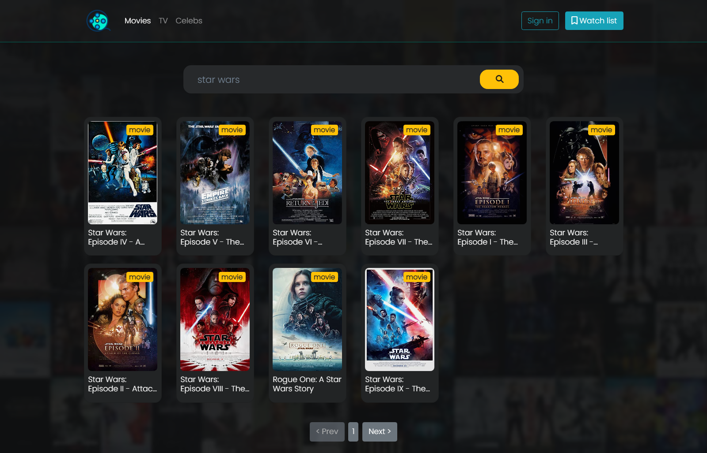
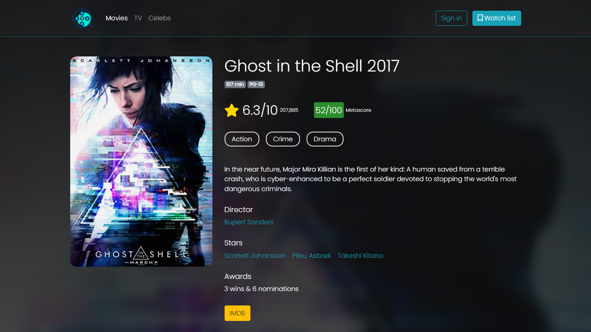

[![Contributors][contributors-shield]][contributors-url]
[![Forks][forks-shield]][forks-url]
[![Stargazers][stars-shield]][stars-url]
[![Issues][issues-shield]][issues-url]
[![MIT License][license-shield]][license-url]
[![LinkedIn][linkedin-shield]][linkedin-url]

<!-- PROJECT LOGO -->
 

  

  <h3 align="center">NEOFILM</h3>

  

    Movie and TV series database
     
    <a href="https://miladxdev.github.io/neofilm-landingpage/"><strong>Live preview »</strong></a>
     
     
    <a href="https://miladxdev.github.io/neofilm-landingpage/">OMDB docs</a>
    ·
    <a href="https://github.com/miladxdev/neofilm-landingpage/issues">Report Bug</a>
    ·
    <a href="https://github.com/miladxdev/neofilm-landingpage/issues">Request Feature</a>
  

`screenshot`

### [LIVE DEMO ☝](https://miladxdev.github.io/neofilm-landingpage/)

## About The Project

This website is a movies, tv shows database that you could search and get some information about any movie such as imdb rating, actors, awards and so on.
click on any searched result to see all information

### Built With

- `HTML`
- `SCSS`
- `Bootstrap 4`
- `jQuery`
- `axios` CDN
- `OMDB api` [_documentation_](http://www.omdbapi.com/)
<!-- ROADMAP -->

## Roadmap

See the [open issues](https://github.com/miladxdev/neofilm-landingpage/issues) for a list of proposed features (and known issues).

<!-- CONTRIBUTING -->

## Contributing

Contributions are what make the open source community such an amazing place to be learn, inspire, and create. Any contributions you make are **greatly appreciated**.

1- Fork the Project

2- Create your Feature Branch

- `git checkout -b feature/AmazingFeature`

3- Commit your Changes

- `git commit -m 'Add some AmazingFeature'`

4- Push to the Branch

- `git push origin feature/AmazingFeature`

5- Open a Pull Request

<!-- LICENSE -->

## License

Distributed under the MIT License. See `LICENSE` for more information.

<!-- CONTACT -->

## Contact

`Milad Gharibi`

Email: miladxdev@gmail.com

Project Link: [https://github.com/miladxdev/neofilm-landingpage](https://github.com/miladxdev/neofilm-landingpage)

<!-- ACKNOWLEDGEMENTS -->

## Acknowledgements

- [Img Shields](https://shields.io)
- [Choose an Open Source License](https://choosealicense.com)
- [GitHub Pages](https://pages.github.com)
- [Font Awesome](https://fontawesome.com)

<!-- MARKDOWN LINKS & IMAGES -->
<!-- https://www.markdownguide.org/basic-syntax/#reference-style-links -->

[contributors-shield]: https://img.shields.io/github/contributors/miladxdev/color-picker-app.svg?style=for-the-badge
[contributors-url]: https://github.com/miladxdev/neofilm-landingpage/graphs/contributors
[forks-shield]: https://img.shields.io/github/forks/miladxdev/color-picker-app.svg?style=for-the-badge
[forks-url]: https://github.com/miladxdev/neofilm-landingpage/network/members
[stars-shield]: https://img.shields.io/github/stars/miladxdev/color-picker-app.svg?style=for-the-badge
[stars-url]: https://github.com/miladxdev/neofilm-landingpage/stargazers
[issues-shield]: https://img.shields.io/github/issues/miladxdev/color-picker-app.svg?style=for-the-badge
[issues-url]: https://github.com/miladxdev/neofilm-landingpage/issues
[license-shield]: https://img.shields.io/github/license/miladxdev/color-picker-app.svg?style=for-the-badge
[license-url]: https://github.com/miladxdev/neofilm-landingpage/blob/master/LICENSE.txt
[linkedin-shield]: https://img.shields.io/badge/-LinkedIn-black.svg?style=for-the-badge&logo=linkedin&colorB=555
[linkedin-url]: https://www.linkedin.com/in/itsmilad/
